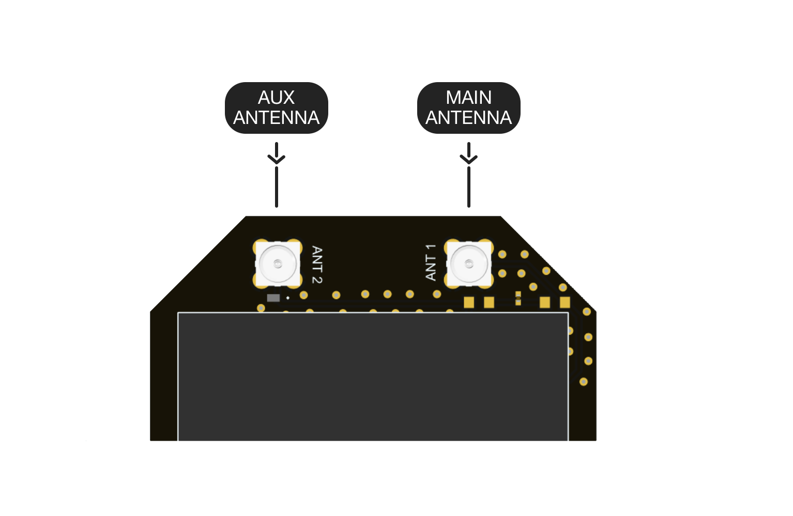

  

# MosaicBus

## What is the MosaicBus project?
**MosaicBus is a Septentrio Open-Source hardware project powered by the Mosaic GNSS receiver that is compatible with the Mikroe mikroBUS standard.**
The objective of this project was to allow easy prototyping and development with the Mosaic by using the mikroBUS ecosystem.

The board also has the option to be used as a standalone device by using the USB-C connector and MosaicBus has been designed to be use either the Septentrio [**Mosaic-x5**](https://www.septentrio.com/en/products/gps/gnss-receiver-modules/mosaic-x5) or the [**Mosaic-H**](https://www.septentrio.com/en/products/gps/gnss-receiver-modules/mosaic-h).

## What is the Mosaic module?
**[Mosaic modules](https://www.septentrio.com/en/products/gnss-receivers/rover-base-receivers/receivers-modules) are Septentrio's small-size and low-power GNSS receiver modules ideal for providing highly accurate positions.** Mosaic modules integrate the latest generation of GNSS technology, delivering highly accurate positions with minimal power consumption. While compact in size they fully retain the high-reliability and exceptional accuracy performance that Septentrio receivers are known for. True multi-frequency multi-constellation technology gives our module receivers access to every possible signal from all available GNSS satellite constellations including the U.S. GPS, European Galileo, Russian GLONASS, as well BeiDou, QZSS and NavIC. [Septentrio’s advanced field-proven algorithms](https://www.septentrio.com/en/company/septentrio-gnss-technology) exploit this signal diversity to deliver maximum positioning availability and reference network compatibility.

## How to set up MosaicBus?
### Hardware
To start using the MosaicBus some antennas need to be connected to the board.
When using a [**Mosaic-x5**](https://www.septentrio.com/en/products/gps/gnss-receiver-modules/mosaic-x5) only a single antenna needs to be connected to the ANT 1 MMCX connector.
However when using the [**Mosaic-H**](https://www.septentrio.com/en/products/gps/gnss-receiver-modules/mosaic-h) a single or dual antenna setup can be configured.
To have a single antenna setup the antenna needs to be connected to the ANT 1 MMCX connector.
When using dual antennas the main antenna is connector to the ANT 1 MMCX connector while the auxillary is connected to the ANT 2 MMCX connector.

Afterwards just click the MosaicBus into a mikroBUS compatible carrier board.

The easiest way to configure the Mosaic is through the USB interface.
When connecting the MosaicBus with a computer through a USB-C cable. 
A new USB device should be visible on the system.
If the system is running Linux or MacOS, the drivers for the Mosaic are automatically installed.
When using a Windows system the drivers have to be installed manually.
These are contained on the new drive visible in file manager.
Running the installer is unnecessary when [**RxTools**](https://www.septentrio.com/en/products/gps-gnss-receiver-software/rxtools) is already installed.

## Interfaces on the MosaicBus
The MosaicBus is compliant with the mikroBUS standard.

  

### Power
In order to power the board there are 2 options.
The first is to use the USB-C connector.
Another option is to use the +5V and ground pins.
This can be powered by any 5V DC supply.

### RESET
To reset the MosaicBus board the nRST pin can be pulled low.
This for example can be done by a GPIO pin or a button.

### COM port
To communicate with the Mosaic a **UART** connection is exposed.
This can be used with a serial reader or a microcontroller.
The following settings are required for this communication to take place.
| baud rate | data bits | stop bits | parity | flow control |
|:---:|:---:|:---:|:---:|:---:|
| 115200 | 8 | 1 | no | none |

On the Mosaic if some settings need to be changed, the ones for *COM3* are the ones exposed and should be edited.

### USB
#### Web interface
By default the Mosaic suppports **Ethernet-over-USB**. Therefore its possible to connect to the receiver and access its information and configuration through a browser.
To do so search to the static IP address which is [`192.168.3.1`]().
This will show the Mosaic's web interface where you can configure the Mosaic.

#### Command line
Another way to connect to the Mosaic receiver is using its COM ports.
These ports should be visible as [`ACM0`]() and [`ACM1`]().
Using a serial terminal such as Putty a connection can be established using the following settings.
| port | baud rate | data bits | stop bits | parity | flow control |
|:---:|:---:|:---:|:---:|:---:|:---:|
| ACM0 / ACM1 | 115200 | 8 | 1 | no | none |

Now you can interface using the command line.
For information on the commands, syntax and reponses the Mosaic Reference Guide section 3.1 can be consulted.

### Events
The MosaicBus has through hole pins which expose 2 event pins. **EVENT A** and **EVENT B**
These can be used to input a time-tagged signal with an accuracy of 20ns.
In turn this will output SBF with can include the position and/or time when the event occurs.
This can be configured using the **setEventParameters** command.

### PPS
The board also exposes a **PPS** output through hole pin.
The polarity, frequency and pulse width of this can be set with the **setPPSParameters** command.
The PPS signal uses 1.8V logic, but can be level-shifted to 3.3V logic if required.

### Antennas 

  

The MosaicBus also has 1 or 2 antenna connectors available depending if you used the Mosaic-x5 or Mosaic-H model.
When using the [**Mosaic-x5**](https://www.septentrio.com/en/products/gps/gnss-receiver-modules/mosaic-x5) the **ANT 1** will be available to use.
When using the [**Mosaic-H**](https://www.septentrio.com/en/products/gps/gnss-receiver-modules/mosaic-h) both the **ANT 1** and **ANT 2** are available to provide dual heading.
*This has to be configured in the Mosaic*

## How to produce
All the files needed are each in their own folder, such as the BOM (Bill Of Materials), the Gerber and Pick-place files.

***Disclamer***
All the files are provided as is. These have not been fully validaded by the author or Septentrio.
The use of any of these files are at your own risk and responsibility.

*Designed by A. Gheeraert*
